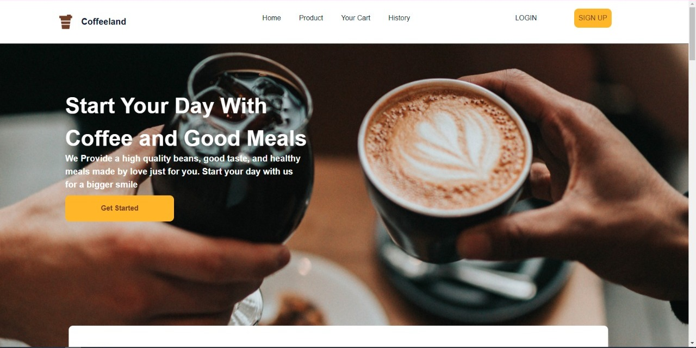
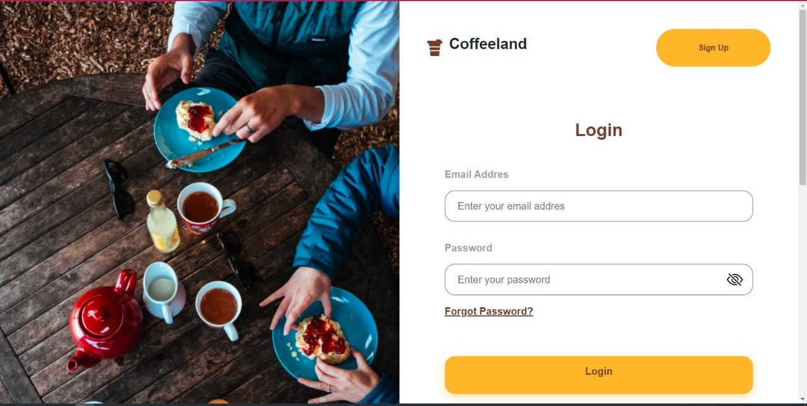
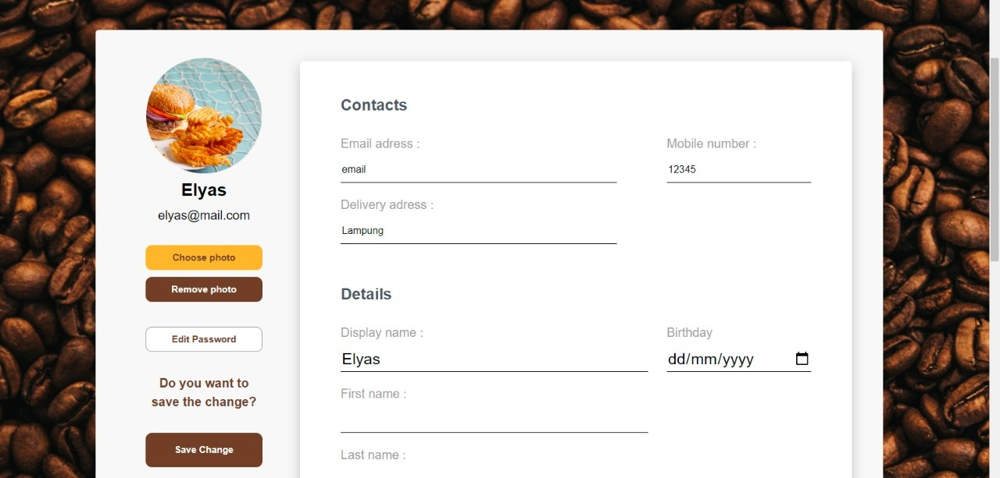
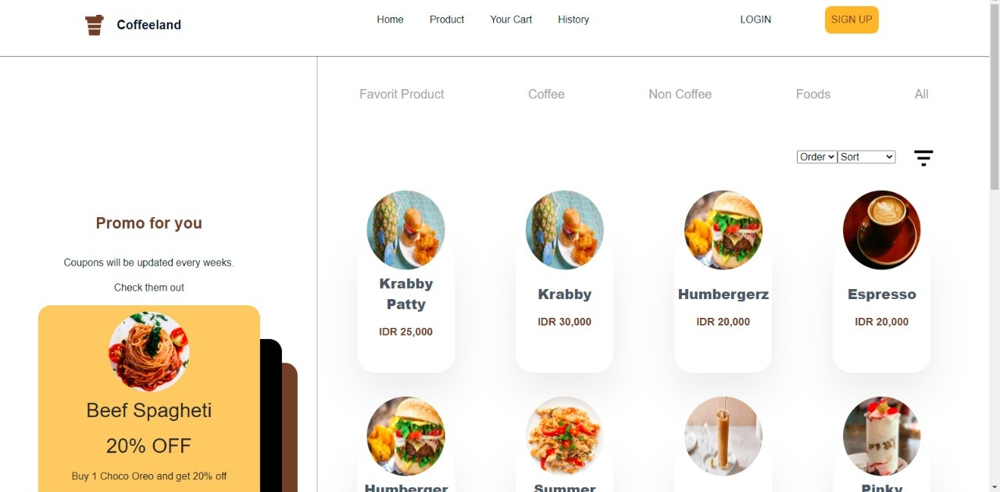
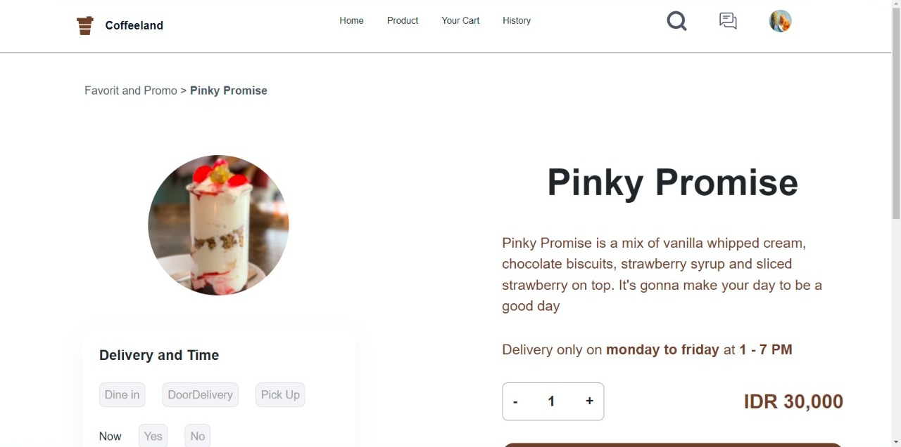

<p align="center">
  
</p>
<div align="center">
<h1>Coffeeland</h1>
<p>Coffeeland is a some place that you can get new idea with a cup of coffee</p>
<br>
</div>

## BUILT WITH


<br>


## HOW TO USE

1. Clone this 2 repository.

   ```
   $ git clone https://github.com/JalalDA/coffeeland-react-app.git

   $ git clone https://github.com/JalalDA/coffeeland.git
   ```

2. Open VS Code or you can download and install it [here](https://code.visualstudio.com/).

3. Open menu **Terminal > New Terminal** or press **ctrl+shift+`**

4. On terminal, change directory to **coffeeland-react-app** then run

   ```
   $ npm start
   ```

5. Open another terminal, change directory to **coffeeland** then run

   ```
   $ npm start
   ```

6. Enjoy the app!

## PREVIEW

<div style="display:flex" >



</div>
<div style="display:flex">


</div>

## Related Project

[coffeeland-backend](https://github.com/JalalDA/coffeeland.git)
